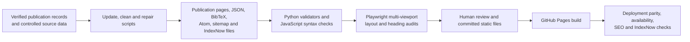

# Dr. Ramtin Mojtahedi — Medical AI Researcher

This repository publishes the official professional portfolio of Dr. Ramtin Mojtahedi, a medical AI researcher working in medical imaging, foundation models, multimodal prediction, and clinically grounded validation.

- [Visit the official website](https://ramtin-mojtahedi.github.io/)
- [Browse verified publication records](https://ramtin-mojtahedi.github.io/publications/)
- [ORCID](https://orcid.org/0000-0002-3953-3256)
- [Google Scholar](https://scholar.google.com/citations?user=KjUrlGUAAAAJ&hl=en)

The site is published with GitHub Pages. Its sitemap, structured data, and crawler-readable publication pages are generated from the verified records in `_data/publications.json`.

<!-- repository-guide:start -->
## Site architecture and maintenance guide

This repository publishes a static professional portfolio through GitHub Pages. Publication records are maintained as structured data and exported into human-readable pages plus crawler- and citation-friendly formats.

### Evidence-backed content pipeline

The scheduled maintenance workflow builds and validates a temporary candidate. It records candidate differences as an artifact and does not commit or push them automatically.

### Runtime and package evidence

| Layer | Evidence |
|---|---|
| Static site | HTML, CSS, and browser JavaScript committed directly in the repository |
| Publication maintenance | Python `3.12` in CI with `requests>=2.32,<3`, `beautifulsoup4>=4.12,<5`, and `rapidfuzz>=3.9,<4` from `scripts/requirements-publications.txt` |
| Core validation | Python scripts that otherwise rely on standard-library parsing, path, JSON, XML, date, and text utilities |
| Visual quality assurance | Node.js `22`; CI installs `playwright@1.52.0` without saving a package lock and installs Chromium for rendered audits |

### Repository map

| Path | Purpose |
|---|---|
| `_data/publications.json` | Canonical publication records used by the site-generation workflow |
| `index.html`, `about/`, `research/`, `publications/` | Public website entry points and content sections |
| `assets/` | Site styles, interaction scripts, publication runtime, contact form, and layout safeguards |
| `scripts/update_publications.py` | Build a candidate publication synchronization from configured sources |
| `scripts/clean_publications.py` | Normalize and clean publication records |
| `scripts/build_search_pages.py` | Generate crawler-readable pages and citation/search artifacts; supports a check mode |
| `scripts/validate_website.py` | Validate required pages, links, data, and generated artifacts |
| `scripts/render_visual_audit.py` | Build the local page used for rendered layout checks |
| `scripts/visual_layout_audit.mjs` | Multi-viewport overlap and layout audit |
| `scripts/visual_heading_audit.mjs` | Multi-viewport heading-integrity audit |
| `.github/workflows/site-quality.yml` | Static, syntax, rendered, responsive, and reduced-motion quality checks |
| `.github/workflows/update-publications.yml` | Scheduled read-only candidate maintenance check |
| `.github/workflows/seo-indexing.yml` | Wait for the exact Pages revision, verify deployed artifacts, check public URLs, and notify IndexNow |
| `.github/workflows/contact-form-activation.yml` | Check contact-relay reachability with a honeypot payload that is not intended for delivery |

### Reproducibility and operating boundary

- Generated publication exports are committed static artifacts. The scheduled job reports prospective changes but does not publish them.
- The visual audit installs Playwright transiently in CI; there is no committed frontend `package.json` or Node lockfile.
- The contact-relay health check establishes endpoint reachability only. It does not assert inbox delivery.
- External publication sources and public web endpoints can change independently of the repository, so candidate updates require review before committing.
- This repository is a static site and maintenance toolkit; it does not publish an installable software package or GitHub Package.
<!-- repository-guide:end -->
